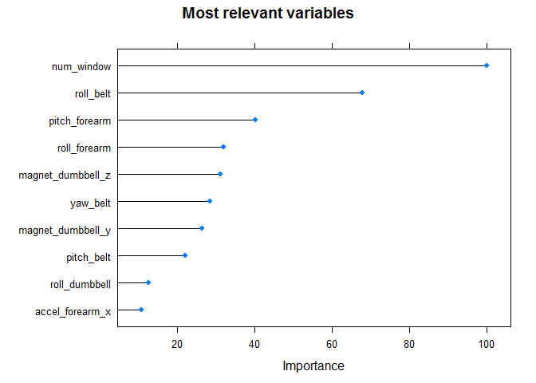

# Random Forest to predict quality of excercise
Javier Saenz  
23. Februar 2016  

## Executive summary
One thing that people regularly do is quantify how much of a particular activity they do, but they rarely quantify how well they do it.  
In this project, we have seen that **using the data from accelerometers** on the belt, forearm, arm, and dumbell we could **predict with Random Forest** method the manner in which 6 participants did an exercise with **99.3% accurancy**.

## Data processing
### Load data

```r
suppressWarnings(library(caret))
training <- read.csv("Data/pml-training.csv", header=T) #load training data
test <- read.csv("Data/pml-testing.csv", header=T) #load test data
```
### Cleaning data

```r
training <- subset(training, select=-c(1:6)) #remove row numbers, time stamp and user names
test <- subset(test, select=-c(1:6)) #remove row numbers, time stamp and user names
classe <- training$classe #save classe information
training <- training[ , colSums(is.na(training)) == 0] #Remove all columns containing at least one NA
test <- test[ , colSums(is.na(test)) == 0] #Remove all columns containing at least one NA
training <- training[,sapply(training,is.numeric)] # remove non-numeric variables
test <- test[,sapply(test,is.numeric)] # remove non-numeric variables
training$classe <- classe; rm(classe) #add classe information and delete variable
```

### Prepare training, validate and test data
Training data set:
-  It includes the parameter to estimate: **classe**
-  We will split the training set on two subsets (50% observations each), train and validate  
-  Train to build the model and validate to validate it  

Test data set:
-  Includes 20 observations, without the parameter **classe** but with **problem_id**


```r
set.seed(33433)
inTraining <- createDataPartition(training$classe, p=0.5, list=FALSE)
train <- training[ inTraining,]
validate  <- training[-inTraining,]
rm(training, inTraining)
```

## Fit model
We will follow the recommendation of the study and use a Random Forest method to model the train data.  
Fore the model accurancy we will be using a **10 fold cross validation** and each forest with 10 trees. 
If accuracy is low then we will try a second model.


```r
set.seed(33433)
tr <- trainControl(method = "cv", number = 10) #setting parameters for the model
fit.rf <- train(classe~.,                      #fit model
              method = "rf", #random forest model
              data = train, 
              trControl = tr, #model parameters
              allowParallel = TRUE, #use parallel processing (if availible)
              ntree = 10, #number of trees
              verbose = FALSE)

print(fit.rf$finalModel)
```

```
## 
## Call:
##  randomForest(x = x, y = y, ntree = 10, mtry = param$mtry, allowParallel = TRUE,      verbose = FALSE) 
##                Type of random forest: classification
##                      Number of trees: 10
## No. of variables tried at each split: 27
## 
##         OOB estimate of  error rate: 2.47%
## Confusion matrix:
##      A    B    C    D    E class.error
## A 2726   21    5    7    4  0.01339124
## B   23 1814   24   15    4  0.03510638
## C    2   26 1651   17    0  0.02653302
## D    2   14   28 1533    8  0.03280757
## E    2   16    9   13 1749  0.02235886
```
## Estimating model accuracy
We evaluate the model with the validation data


```r
set.seed(33433)
pred.rf <- predict(fit.rf, newdata = validate) #Predict with validation data
confusionMatrix(pred.rf, validate$classe)$overall[1] #Measure accuracy with validation data
```

```
## Accuracy 
## 0.993578
```
We get 99.3% accuracy!!  
There is no need to improve the model


## Most relevant variables
Here we plot the variables that have a higher impact on the fitted model

```r
VarImportance <- varImp(fit.rf)
plot(VarImportance, main = "Most relevant variables", top = 10)
```



## Predict classe
Now we will predit **classe** for each **problem_id** of the test data set


```r
pred.rf.test<-predict(fit.rf, newdata = test[,-which(names(test) %in% "problem_id")])
t(data.frame(problem_id = test$problem_id, prediction = pred.rf.test))
```

```
##            [,1] [,2] [,3] [,4] [,5] [,6] [,7] [,8] [,9] [,10] [,11] [,12]
## problem_id " 1" " 2" " 3" " 4" " 5" " 6" " 7" " 8" " 9" "10"  "11"  "12" 
## prediction "B"  "A"  "B"  "A"  "A"  "E"  "D"  "B"  "A"  "A"   "B"   "C"  
##            [,13] [,14] [,15] [,16] [,17] [,18] [,19] [,20]
## problem_id "13"  "14"  "15"  "16"  "17"  "18"  "19"  "20" 
## prediction "B"   "A"   "E"   "E"   "A"   "B"   "B"   "B"
```

## Data source
- Website: http://groupware.les.inf.puc-rio.br/har  
- Paper: http://groupware.les.inf.puc-rio.br/public/papers/2013.Velloso.QAR-WLE.pdf  
- The training data: https://d396qusza40orc.cloudfront.net/predmachlearn/pml-training.csv  
- The test data: https://d396qusza40orc.cloudfront.net/predmachlearn/pml-testing.csv  
